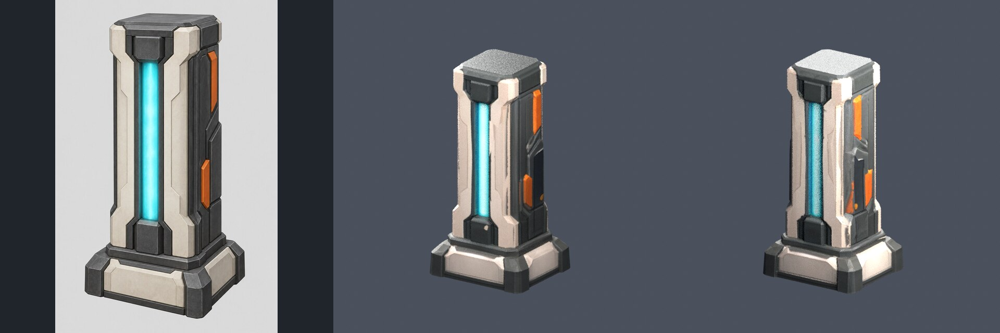

# Energy pillar v2 — generated static style sample

2026-09-09, reviewed by Amp. **Ready for engine integration testing, not runtime
accepted or publicly released.** Original industrial-arena style study, not an
exact reproduction of absent original game map/character data.

## Generation and bill

- Generating account: `xiaomao`, account ID 1, explicitly selected default
  `OG_API_KEY`. Read-only account/token queries confirmed ownership, available
  user quota and an unlimited, nonexpiring token without model restrictions.
  Default and publisher credentials differ. Publisher remains `og-atlas`;
  no publishing identity, account quota, billing or Gateway routing was changed.
- Prototype: `gpt-image-2`, request
  `202609091652454205540648268d9d6gKoxeiOR`, one submission. PNG 1024×1536,
  1,750,236 bytes. Actual matched charge: **$0.019076** (9538 quota units).
- 3D: `hunyuan3d-2`, task `task_3fR84E6SPQFuSAkwcAkXMt19ZvXKkIub`, request
  `202609091654400146392608268d9d6CWYHObzM`, one submission. Completed GLB:
  3,940,908 bytes. Actual matched charge: **$0.50** (250000 quota units).
- Successful v2 total: **$0.519076**. Cost matches `/api/log/token` request IDs
  and models, not a guessed per-image price. Task timing report is retained in
  the machine receipt. No new generation was used for local export iterations.

Two earlier rejected calls are retained, not hidden in this total:

| Revision/identity | Request ID | Result | Accounting |
|---|---|---|---|
| v1 publisher named key | `202609091642479419580078268d9d6zFJePghC` | HTTP403 `insufficient_user_quota`, reported $0 user balance | No success/asset/task; actual fee not matched, remains unreconciled |
| v1 default key | `202609091649570263075678268d9d60bpmQjay` | HTTP500 `get_channel_failed`, Grok unavailable in default group | No success/asset/task; actual fee not matched, remains unreconciled |

Neither rejected request was retried. The main thread explicitly chose GPT
Image 2 for v2; a new manifest/work directory and operation ID preserve the
model switch. It was not a replay of an unknown task. No other models were tried.

## Visual and format inspection

- Prototype: single complete pillar, graphite/ivory body, cyan vertical slot,
  orange side connector, no text/logo or detached geometry. Approved by hash
  before 3D submission. Single view does not specify hidden back/left geometry.
- Blender 3.4.1: cleaned/joined mesh, uniform 1.6 m scale target, ground-centered
  pivot, decimated from 40000 input polygons to **1800 triangles**. Quantized
  bounds: x −15.875..15.90625, y −14.203125..14.21875, z 0.015625..63.984375
  Q3 units. The small bound shift is from decimation after initial scaling.
- Output: **5051 vertices across 6 MD3 surfaces**, one frame, one material,
  1024×1024 baked base-color TGA. The split handles UV/normal seam duplication;
  each surface meets actual renderer limits: ≤999 vertices and ≤5999 indices
  (whole triangles allow at most 5997). MD3: 103636 bytes.
  Surface vertex/triangle/index counts: 997/350/1050, 999/360/1080,
  998/354/1062, 997/356/1068, 997/359/1077, 63/21/63.
  The prior two-surface package was format-valid but **runtime-invalid** and is
  superseded: `R_LoadMD3` rejects ≥1000 vertices or ≥6000 indices. No engine
  limits were changed. Independent binary decoding confirmed all 1800 ordered
  triangles, UVs and encoded normals identical; texture/shader bytes unchanged.
  All 23 tests passed including real Blender processing and independent binary
  boundary cases (999→1000 vertices, 5997→6000 indices). Reprocessing used only
  local sources; generation IDs, submissions and charges are unchanged.
- Front/back review renders are made from **decoded exported MD3 positions,
  UVs and quantized normals**, not the unexported GLB. Both views show complete
  structure with no obvious holes/floating parts or UV/black-texture failure.
  Silhouette and palette remain recognizable. Some texture/render grain remains;
  close-up art polish and in-engine filtering/light response are pending.
  The rebuilt review shows no new split seams/missing chunks; noisy surfaces
  and fragmented rear panel appearance remain art-polish issues, not resolved
  by this export-limit correction. Blender renders are not runtime validation.
- PBR material has been deliberately reduced to base-color diffuse. This does
  not preserve metallic highlights, normal maps or true emission. Original GLB
  remains available for a future GL2 material pass. No collision is supplied.
- PK3 size: **1,624,174 bytes**, SHA-256
  `0b30c9f6d82fbf72155557bc2b9e9cac6de6d6724567ec1b1400cb5cb99646dc`.
  Only model, TGA and shader are packaged. No source data, credentials, remote
  URLs or test-fixture geometry is included.

## Files and source retention

- Runtime candidate: [`../runtime/energy-pillar-v2.pk3`](../runtime/energy-pillar-v2.pk3).
- Full hashes, task IDs, costs, tool fingerprints:
  [`energy-pillar-v2.json`](energy-pillar-v2.json).
- Raw prototype: `assets/remaster/work/energy-pillar-v2/prototype.png`.
- Raw generated GLB: `assets/remaster/work/energy-pillar-v2/generated.glb`.
- Blender master: `assets/remaster/work/energy-pillar-v2/processed/cleaned.blend`.
- Private crash-recovery state/requests/responses are also in that work
  directory. Do not publish them or confuse them with the sanitized receipt.

Raw source/master files are ignored by Git and currently retained in this
production thread's orb. **Durable external archival is still pending.** The
main thread confirmed download/hash verification of the original three source
files. Prototype/GLB hashes remain unchanged; the locally resaved Blender master
has an updated hash in the machine receipt and can be downloaded again if needed.
Do not regenerate because a checkout lacks raw files.

## Receiving engine workstream

Load the candidate PK3 through the normal Quake filesystem. Its model path is
`models/remaster/energy_pillar.md3`, texture path
`models/remaster/energy_pillar.tga`, shader file
`scripts/remaster_energy_pillar_v2.shader`. Use a neutral controlled scene;
validate front axis, 40 units/m, placement, culling, lighting, texture filtering,
browser memory and cache/reload behavior. Browser screenshots/play tests are
required before changing `runtime_accepted`. Do not use a Three.js preview.

Next production input: approve this material/silhouette direction and supply
measured connector dimensions plus consistent orthographic views for the first
wall/door module. Exact remakes additionally need the authorized original
reference/data; permission does not supply the absent source. Character work
continues IQM-first elsewhere; no MD3 character batch was created here.
